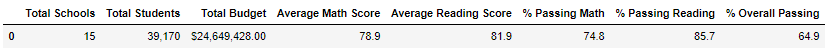
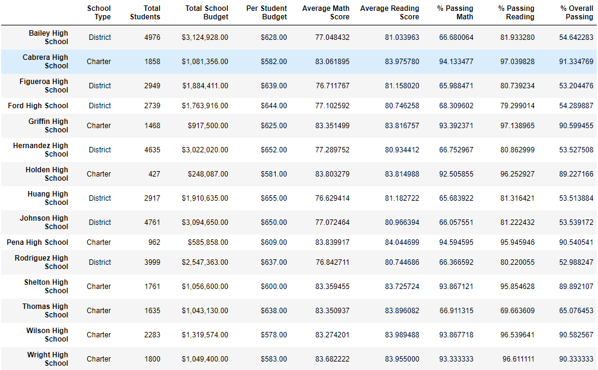
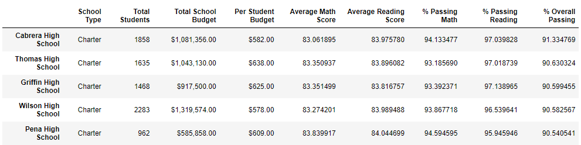
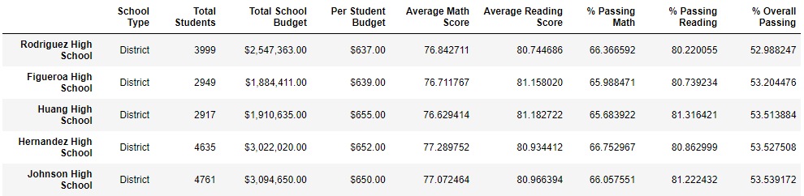
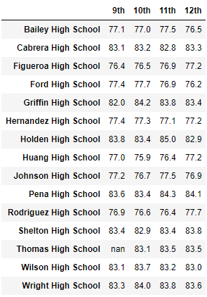
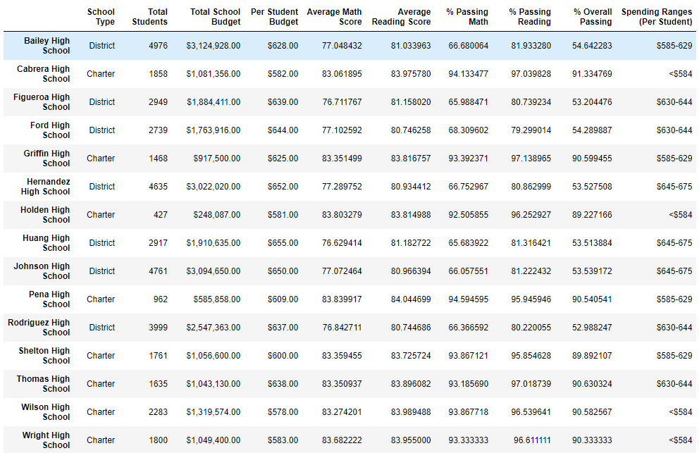
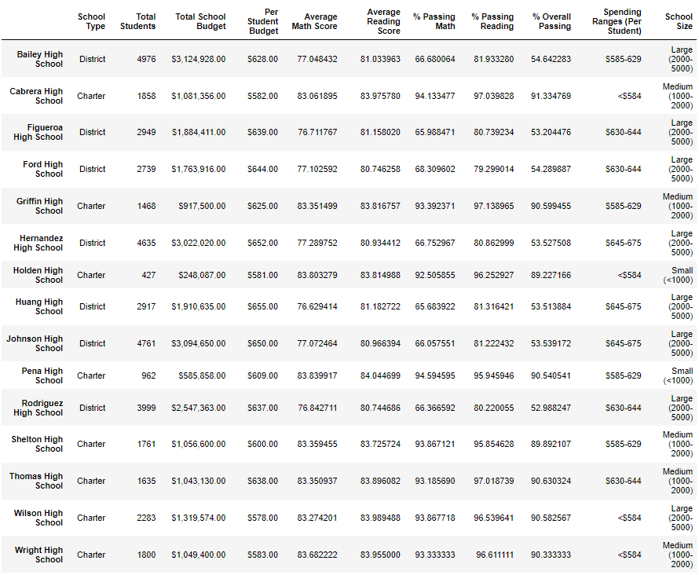

# School District Analysis

## Overview of the School Data Results
In this challenge assigned, the client, the school board, believe that an alteration to student's grades at Thomas High School was happening. The resulting academic dishonesty having put distrust in the data provided and they want to find out how much it has affected their overall data.

Overall the drop in the 9th grade scores did not cause a significant change in the results.

## Results of the School Data
### School Summary
* How is the district summary affected?
   * The average math score dropped whereas the average reading score stayed the same.
* How is the school summary affected?
   * The score did affect how the top 5 results came back, with Thomas High School receiving a large drop in ranking.
* How does replacing the ninth graders’ math and reading scores affect Thomas High School’s performance relative to the other schools?
   * 

### High and Low Performing Schools

### Math and Reading Scores by Grade
* How does replacing the ninth-grade scores affect the following: Math and reading scores by grade

### Scores by School Spending
* How does replacing the ninth-grade scores affect the following: Scores by school spending

.png)

### Scores by School Size
* How does replacing the ninth-grade scores affect the following: Scores by school size

.png)

### Scores by School Type
* How does replacing the ninth-grade scores affect the following: Scores by school type

.png)

## Summary
