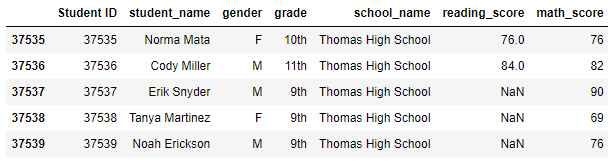
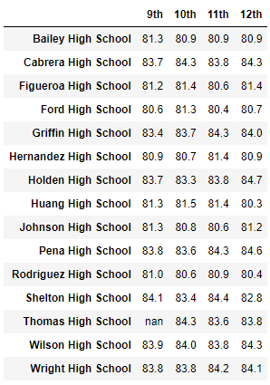

# School District Analysis

## Overview of the School Data Results
In this challenge assigned, the client, the school board, believe that an alteration to student's grades at Thomas High School was happening. The resulting academic dishonesty having put distrust in the data provided and they want to find out how much it has affected their overall data.

Overall the drop in the 9th grade scores did not cause a significant change in the results.

## Results of the School Data
### School Summary
* How is the district summary affected?
   * The average math score dropped whereas the average reading score stayed the same.
* How is the school summary affected?
   * The score did affect how the top 5 results came back, with Thomas High School receiving a large drop in ranking. 
* How does replacing the ninth graders’ math and reading scores affect Thomas High School’s performance relative to the other schools?
   * Thomas High School may have dropped out the top 5 but it did not drop significantly to bottom 5 without its 9th grader scores. Having a whole grade dropped can prove to be significant in how a school can present in the data.

.png)

### High and Low Performing Schools

### Math and Reading Scores by Grade
* How does replacing the ninth-grade scores affect the following: Math and reading scores by grade
   * It did not affect the other grades (10th through 12th) with the adjustment of the data, only affecting the 9th grade. It would only result in the 9th grade scores presenting as NaN and not use it during calculations within the full summaries.

### Scores by School Spending
* How does replacing the ninth-grade scores affect the following: Scores by school spending
   * It didn't affect the score spending ranges but it did so for the passing spending ranges. Omitting a whole grade in one school does affect how many *students* are to pass, as many students are basically notes as having no grade whatsoever.
   

.png)

### Scores by School Size
* How does replacing the ninth-grade scores affect the following: Scores by school size
   * As with the school spending, it didn't affect the average scores by did affect the passing percentages in the same way as before.
 

.png)

### Scores by School Type
* How does replacing the ninth-grade scores affect the following: Scores by school type
   * This had a more noticable drop in the percentages across the whole board, as Thomas High School was a charter and thus affected the whole category negatively.
 
.png)

## Summary
All in all the scores of the 9th graders being dropped did affect the data though in a way that wasn't compensated for by adjusting the other schools data to exclude their 9th graders as well. It wasn't the most conclusive, nor consistent (in terms of having a scientific constant), in achieving the data.
